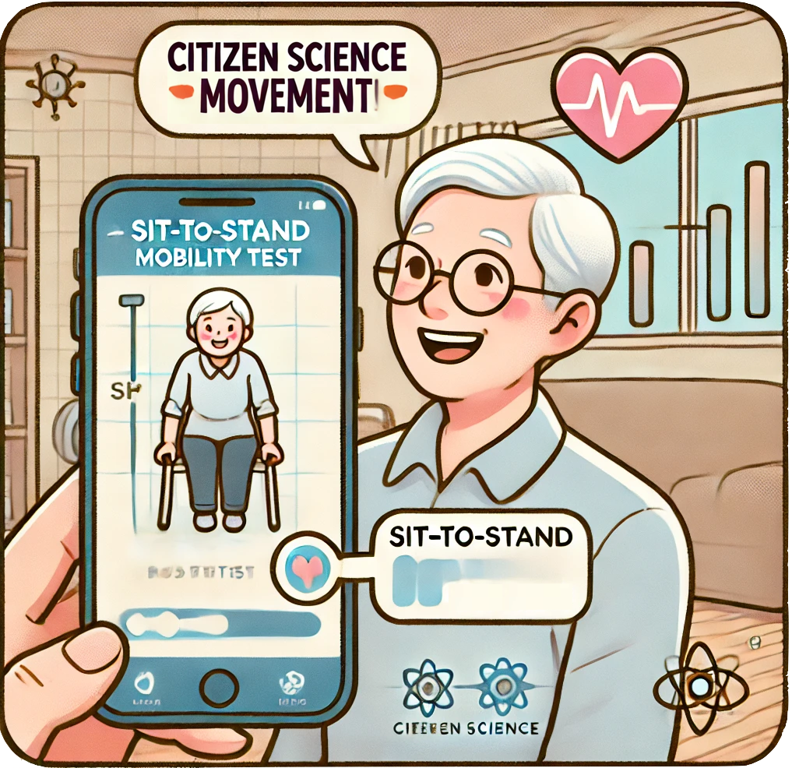

 

# **Seja um Cientista Cidadão!**

 

 

Você sabia que pode contribuir com a ciência usando apenas o seu celular?

A Plataforma SAUDE convida você — pessoa idosa ou cuidador — a fazer parte de uma pesquisa inovadora sobre saúde e envelhecimento! Ao participar, você se torna um cientista cidadão, ajudando a coletar dados importantes sobre equilíbrio, mobilidade e funcionalidade física.

 

## Por que participar?

- Você acompanha sua própria saúde de forma autônoma.

- Contribui para melhorar políticas públicas e ações de saúde.

- Fortalece sua autonomia e promove um envelhecimento saudável.

- Ajuda pesquisadores a entender melhor como vivem e se movem os idosos no dia a dia.

 

## Como participar?

Basta utilizar o nosso aplicativo gratuito para realizar testes simples, como o Sentar e Levantar, o Apoio em Um Pé Só e o Timed Up and Go (TUG), diretamente na sua casa.

 

## Sua experiência pode transformar o futuro da saúde!

Participe da construção do conhecimento.

Seja protagonista da sua saúde. Seja um **cientista cidadão**.

 

# **Ciência Cidadã**

A ciência cidadã, amplamente definida como a participação de não cientistas no processo de produção do conhecimento científico, tem se consolidado como uma abordagem estratégica no campo da saúde. Ao permitir o envolvimento direto de pessoas idosas em pesquisas participativas e contextualmente relevantes, essa abordagem contribui para o fortalecimento da autonomia, da percepção de empoderamento, da saúde e do senso de pertencimento social.

No contexto do envelhecimento, a ciência cidadã permite relacionar as modificações fisiológicas e funcionais associadas à idade com fatores ambientais e sociais que podem atuar como barreiras ou facilitadores da funcionalidade. Esse processo amplia a compreensão sobre como esses elementos afetam diretamente a vida dos idosos, especialmente frente à redução da atividade física, perda de capacidade funcional e comprometimento da autonomia e independência. Tais impactos, por sua vez, elevam a suscetibilidade a patologias e o risco de mortalidade, tornando urgente o desenvolvimento de estratégias preventivas baseadas na participação ativa dessa população.

 

# **SAUDE**

A Plataforma **SAUDE** (**S**istema de **A**valiação e **U**tilização de **D**ados sobre **E**nvelhecimento) é uma solução digital desenvolvida com base na abordagem da **Ciência Cidadã**, voltada à avaliação funcional de pessoas idosas. Seu principal objetivo é capacitar os próprios cidadãos – especialmente os idosos – a participarem ativamente na coleta e no monitoramento de dados sobre sua saúde física, incluindo força muscular, equilíbrio e mobilidade.

Por meio de um aplicativo móvel simples e acessível, a plataforma permite a realização de testes funcionais, como o Timed Up and Go (TUG), o Teste de Apoio Unipodal (TAU) e o Teste de Sentar e Levantar (TSL), diretamente no ambiente domiciliar dos usuários.

Ao integrar tecnologia digital com participação cidadã, a plataforma promove o engajamento comunitário, amplia a geração de dados em tempo real e oferece subsídios para o desenvolvimento de políticas públicas mais eficazes voltadas ao envelhecimento saudável.

 

  **SAUDE** foi desenvolvida a partir da tese de Doutorado Acadêmico em Ciências da Reabilitação pelo Centro Universitário Augusto Motta [UNSUAM](https://hs.unisuam.edu.br/ppgcr-ciencias-da-reabilitacao), por <a id="cy-effective-orcid-url" class="underline" href="https://orcid.org/0000-0003-1902-7257" target="orcid.widget" rel="me noopener noreferrer" style="vertical-align: baseline;">  Alexandre Gomes Sancho</a> ([Lattes](http://lattes.cnpq.br/9275662393258083)), sob orientação de <a id="cy-effective-orcid-url" class="underline" href="https://orcid.org/0000-0001-7014-2002" target="orcid.widget" rel="me noopener noreferrer" style="vertical-align: baseline;">  Arthur de Sá Ferreira</a> ([Lattes](http://lattes.cnpq.br/5432142731317894)).

 
